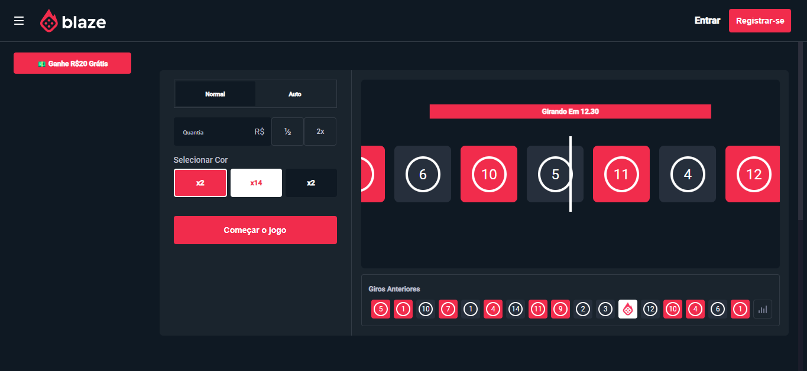

# CloneBlaze
Clone do cassino online Blaze



## Configurações
- Versão do Angular: 19.0.2
- Versão do Node.js: 20.11.1

## Servidor de desenvolvimento

Para iniciar um servidor de desenvolvimento local, execute:

```bash
ng serve
```

Depois que o servidor estiver em execução, abra seu navegador e navegue até `http://localhost:4200/`.
